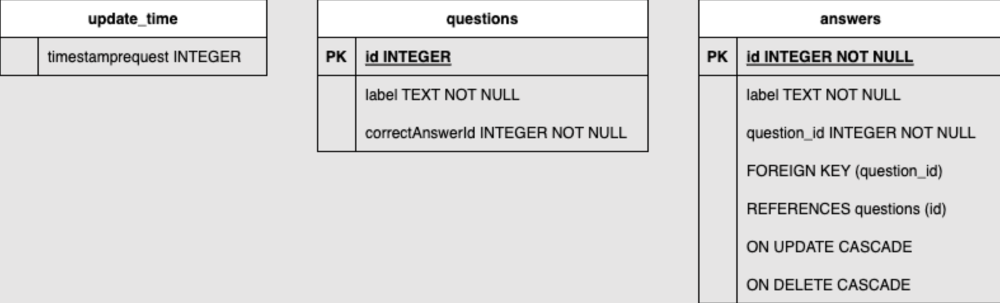

# Persistence 

## Shared Preferences 

#### Definition

Shared Preferences provide a simple way to store key-value pairs persistently. 

Shared preference is an API that will store un an XML file simple data types like int, double, bool, String and StringList or json encoded objects.

#### Declare the dependency
```yaml
flutter pub add shared_preferences
```  

#### Save data
```dart
// Load and obtain the shared preferences for this app.
final prefs = await SharedPreferences.getInstance();

// Save the counter value to persistent storage under the 'counter' key.
await prefs.setInt('counter', counter);
```

#### Read data
```dart
final prefs = await SharedPreferences.getInstance();

// Try reading the counter value from persistent storage.
// If not present, null is returned, so default to 0.
final counter = prefs.getInt('counter') ?? 0;
```

## 🧪 Exercise


::: warning Exercise 1 - Use shared preferences to store quiz data and timestamp of last successful API fetch.

Use SharedPreferences to 
- Store the json quiz data fetched from the API on a String key "quiz_data".
- Store an integer value containing the timestamp of the last successful API fetch.
- On app launch, check if there is quiz data stored in SharedPreferences than is less than 5 minutes old.
- if yes, load the quiz data from SharedPreferences
- if no, fetch the quiz data from the API, store it in SharedPreferences along with the new timestamp.

::: tip Solution 

::: details Expand
[https://zapp.run/edit/flutter-zhhc06v0hhd0?](https://zapp.run/edit/flutter-zhhc06v0hhd0?)
:::


##  Database

SQLite is a powerful and lightweight relational database that's commonly used for data storage in Flutter apps. 

On mobile development, SQLite is a popular choice for local data storage due to its efficiency and ease of use. It is mainly used for offline data storage, caching, and managing structured data.

There is multiple packages to use SQLite in Flutter from low-level to high-level abstractions. The most popular ones are [`sqflite`](https://pub.dev/packages/sqflite) and [`drift`](https://pub.dev/packages/drift/example).

::: warning support
sqlflite is not supported on web platform.
:::

#### Declare the dependency
```yamlyaml
flutter pub add sqflite
```
#### Creating and managing SQLite databases.
```dart
import 'package:sqflite/sqflite.dart';

// Open the database and store the reference.
final database = openDatabase(
   // Set the path to the database.
   join(await getDatabasesPath(), 'quiz_database.db'),
   // When the database is first created, create a table to store quizzes.
   onCreate: (db, version) {
       return db.execute(
             'CREATE TABLE quizzes(id INTEGER PRIMARY KEY, question TEXT, answer TEXT)',
          );
   },
   // Set the version. This executes the onCreate function and provides a
   // path to perform database upgrades and downgrades.
   version: 1,
);
```
#### Prepare the data model

Here is an example of a complex data type with sub-mapping. Sub-mapping for complex data types need to be handled. It consists in converting the subobject to map when saving to database and reconstructing the subobject from map when reading from database.

```dart
class Question {
  final String text;
  final List<Answer> answers;
   Question({required this.text, required this.answers});
   Map<String, dynamic> toMap() {
       return {
             'text': text,
             //  answers need to be converted to map
               'answers': answers.map((answer) => answer.toMap()).toList(),
       };
   }
```

#### Performing CRUD (Insert, Read, Update, Delete) operations.

##### Insert data
```dart
Future<void> insertQuiz(Quiz quiz) async {
   // Get a reference to the database.
   final db = await database;    
   // Insert the Quiz into the correct table. Also specify the
   // `conflictAlgorithm`. In this case, if the same quiz is inserted
   // multiple times, it replaces the previous data.
   await db.insert(
         'quizzes',
         quiz.toMap(),
         conflictAlgorithm: ConflictAlgorithm.replace,
   );
}
```
##### Read data
```dart
Future<List<Quiz>> quizzes() async {
   // Get a reference to the database.
   final db = await database;
   // Query the table for all The Quizzes.
   final List<Map<String, dynamic>> maps = await db.query('quizzes');
   // Convert the List<Map<String, dynamic> into a List<Quiz>.
   return List.generate(maps.length, (i) {
         return Quiz(
               id: maps[i]['id'],
               question: maps[i]['question'],
               answer: maps[i]['answer'],
         );
   });
}
```
##### Update data
```dart
Future<void> updateQuiz(Quiz quiz) async {
   // Get a reference to the database.
   final db = await database;
   // Update the given Quiz.
   await db.update(
         'quizzes',
         quiz.toMap(),
         // Ensure that the Quiz has a matching id.
         where: 'id = ?',
         // Pass the Quiz's id as a whereArg to prevent SQL injection.
         whereArgs: [quiz.id],
   );
}
```
##### Delete data
```dart
Future<void> deleteQuiz(int id) async {
   // Get a reference to the database.
   final db = await database;
   // Remove the Quiz from the database.
   await db.delete(
         'quizzes',
         // Use a `where` clause to delete a specific quiz.
         where: 'id = ?',
         // Pass the Quiz's id as a whereArg to prevent SQL injection.
         whereArgs: [id],
   );
}
```

## 🧪 Exercises 

Implement the following database schema to store quiz questions and answers:



  #### Steps
1. Sqflite dependency declaration
2. Database initialization
3. Data model creation
4. SQL CRUD functions implementation

Please find below some usefull functions to get you started :

::: details Database initialization
```dart
return await openDatabase(
      dbPath,
      version: 1,
      onCreate: (Database db, int version) async {
        try {
          await db.execute('''
        CREATE TABLE questions (
          id INTEGER PRIMARY KEY,
          label TEXT NOT NULL,
          correctAnswerId INTEGER NOT NULL
        )
      ''');

          // Create the 'answers' table
          await db.execute('''
        CREATE TABLE answers (
          id INTEGER,
          label TEXT NOT NULL,
          question_id INTEGER NOT NULL,
          PRIMARY KEY (id, question_id),
          FOREIGN KEY (question_id) REFERENCES questions (id) ON DELETE CASCADE
        )
      ''');
        } catch (e) {
          // Handle database creation errors
          print('Error during database creation: $e');
          // Log or display the error as needed
        }
        await db.close();
      },
    );
```
:::

::: details SQL CRUD functions
```dart
Future<void> insertQuestionsWithAnswers(List<Question> questions) async {
    Database db = await database; // Assuming 'database' is your SQLite database instance

    await db.transaction((txn) async {
      for (var question in questions) {
        int questionId = await txn.rawInsert(
          'INSERT INTO questions (label, correctAnswerId) VALUES (?, ?)',
          [question.label, question.correctAnswerId],
        );

        for (var answer in question.answers) {
          await txn.rawInsert(
            'INSERT INTO answers (id, label, question_id) VALUES (?, ?, ?)',
            [answer.id, answer.label, questionId],
          );
        }
      }
    });
    await db.close();
  }


  Future<List<Question>> getQuestionsWithAnswers() async {
    Database db = await database;
    List<Map<String, dynamic>> questionMaps = await db.rawQuery('''
    SELECT questions.id AS id, questions.label AS label, questions.correctAnswerId AS correctAnswerId, answers.id AS answer_id, answers.label AS answer_label 
    FROM questions
    INNER JOIN answers ON questions.id = answers.question_id
  ''');

    Map<int, Question> questionMap = {};

    for (var questionMapData in questionMaps) {
      final questionId = questionMapData['id'] as int;
      final answerId = questionMapData['answer_id'] as int; // Assuming answer ID is prefixed with 'answers.'
      final answerLabel = questionMapData['answer_label'] as String; // Assuming answer label is prefixed with 'answers.'

      if (!questionMap.containsKey(questionId)) {
        questionMap[questionId] = Question.fromMap(questionMapData);
        questionMap[questionId]!.answers = [];
      }

      // Adding answers to respective questions
      questionMap[questionId]!.answers.add(Answer(id: answerId, label: answerLabel));
    }

    await db.close();

    return questionMap.values.toList();
  }

  Future<void> deleteQuestions() async {
    Database db = await database;
    await db.rawDelete('DELETE FROM questions');
    await db.close();
  }

  Future<void> deleteAnswers() async {
    Database db = await database;
    await db.rawDelete('DELETE FROM answers');
    await db.close();
  }
  ```
:::

5. SQLite database integration after network fetch and on app launch

::: warning You can follow this logic for step 5:


1. First app launch **with** network: 
   * Make an **API request** and store in the database.
2. First app launch **without** network:
   * Generate a **mock** list of questions.
3. App launch **without** network:
   * Return data from the **database** even if it's old data.
 App launch with network, with the last request **within 5 minutes**:
   * Return data from the **database**.
4. App launch with network, with the last request **over 5 minutes** ago:
   * Make an **API request**, return the data, and store in the database, store also the timestamp of the last successful request.
:::

### 🎯 Solutions

::: details Here
[Github repository sources](https://github.com/gbrah/learning-src-2023-flutter)
:::

##  File I/O 

- Understanding file operations.
- Reading and writing files in Flutter.
- Permissions and file handling best practices.

Files are essential for storing and managing data in many applications. This lesson guides you through the basics of file input/output operations in Flutter, including reading and writing files. You'll also learn about permissions and best practices for secure and efficient file handling.

## 📖 Further reading

- [SQLite](https://docs.flutter.dev/cookbook/persistence/sqlite)
- [SharedPrefs](https://docs.flutter.dev/cookbook/persistence/key-value)