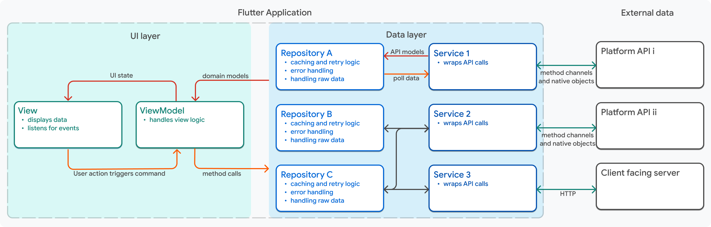

# Other features 

## Auto Json serialization 

with   json_annotation and json_serializable packages, you can easily serialize and deserialize JSON data in your Flutter app. This lesson covers how to set up these packages, define your data models, and generate the necessary code for JSON serialization.

To use json_annotation and json_serializable, you need to add the following dependencies to your pubspec.yaml file:

```yaml
dependencies:
  json_annotation: ^4.0.1  
dev_dependencies:
  build_runner: ^2.0.4
  json_serializable: ^4.1.3
```
Then, you can define your data model and annotate it with @JsonSerializable to enable JSON serialization. For example:

```dart
import 'package:json_annotation/json_annotation.dart';
part 'user.g.dart'; // This file is generated by the json_serializable package.

@JsonSerializable()
class User {
  final String name;
  final int age;

  User({required this.name, required this.age});

  factory User.fromJson(Map<String, dynamic> json) => _$UserFromJson(json);
  Map<String, dynamic> toJson() => _$UserToJson(this);
}
```

## 🧪 Exercise

::: warning Exercise 1 - Enable JSON serialization for a quiz app
In this exercise, you will enable JSON serialization for a quiz app that fetches quiz data from an API. You will define the data models for the quiz questions and answers, annotate them for JSON serialization, and generate the necessary code to handle JSON data effectively in your app.

Delete manual JSON parsing code from your quiz app and replace it with the json_serializable approach.

:::

::: tip Complete solution
::: details Expand


**pubsec.yml**
``` yml 
dependencies:
...
  json_annotation: ^4.8.1
...

dev_dependencies:
 ...
  json_serializable: ^6.6.2
  build_runner: ^2.3.3
```

**model/quiz.dart**
```dart 
import 'package:json_annotation/json_annotation.dart';

part 'quiz.g.dart';

@JsonSerializable(explicitToJson: true)
class Quiz {
  List<Question> questions;

  Quiz({required this.questions});

  factory Quiz.fromJson(Map<String, dynamic> json) => _$QuizFromJson(json);
  Map<String, dynamic> toJson() => _$QuizToJson(this);
}

@JsonSerializable(explicitToJson: true)
class Question {
  int id;
  String label;
  @JsonKey(name: 'correct_answer_id')
  int correctAnswerId;
  List<Answer> answers;

  Question({
    required this.id,
    required this.label,
    required this.correctAnswerId,
    required this.answers,
  });

  factory Question.fromJson(Map<String, dynamic> json) => _$QuestionFromJson(json);
  Map<String, dynamic> toJson() => _$QuestionToJson(this);
}

@JsonSerializable()
class Answer {
  int id;
  String label;

  Answer({
    required this.id,
    required this.label,
  });

  factory Answer.fromJson(Map<String, dynamic> json) => _$AnswerFromJson(json);
  Map<String, dynamic> toJson() => _$AnswerToJson(this);
}
```

Generate the JSON serialization code `quiz.g.dart`by running the following command in your terminal:

```bash
dart run build_runner build --delete-conflicting-outputs
```

* Download the project code [here 💾](https://github.com/gbrah/learning-2023-flutter/raw/refs/heads/main/docs/src/assets/sources/step6-jsonserialization.zip)

[//]: <> (https://zapp.run/edit/flutter-zjs606fzjs70)
:::


## Architectural Patterns

- Introduction to architectural patterns.
- Why architectural patterns are important.
- Common architectural patterns in Flutter.

Architectural patterns provide a structured way to organize your app's code. This lesson introduces various architectural patterns and explains why they are important. You'll also explore common architectural patterns used in Flutter development.

#### Architecture overview


Google recently introduced the MVVM (Model-View-ViewModel) pattern as a recommended architecture for Flutter apps. This lesson guides you through implementing the MVVM pattern in your Flutter app, including how to structure your code and manage state effectively.

The documentation for the flutter architecture can be found [here](https://docs.flutter.dev/app-architecture/guide).


``` shell
lib/
├── data/
│   ├── model/
│   ├── repositories/
│   │   └── quiz_repository.dart
│   └── services/
│       ├── api_service.dart
│       ├── database_service.dart
│       ├── mock_service.dart
│       ├── platform_service.dart
│       └── shared_prefs_service.dart
├── domain/
│   ├── models/
│   │   ├── quiz.dart
│   │   └── quiz.g.dart
│   └── routing/
│       └── app_routes.dart
├── ui/
│   ├── quiz/
│   │   ├── view_models/
│   │   │   └── quiz_view_model.dart
│   │   └── widgets/
│   │       └── quiz_screen.dart
│   ├── score/
│   │   ├── view_models/
│   │   └── widgets/
│   │       └── score_screen.dart
│   └── welcome/
│       └── widgets/
│           └── welcome_screen.dart
└── utils/
    ├── command.dart
    └── main.dart
```

#### Components

| Layer | Component | Sub-Components/Files | Detailed Description |
|-------|-----------|---------------------|----------------------|
| **Data** | **Models** | API Models, Database Models, Request/Response Wrappers | Data Transfer Objects (DTOs) that represent raw data structures from external sources. Mirror backend response formats, handle JSON serialization/deserialization. Converted from API/database into domain entities. Framework-specific, contain only data without business logic. |
| **Data** | **Repositories** | Repository Implementations | Concrete implementations of domain repository interfaces. Act as single source of truth, coordinating multiple data sources (API, local database, cache, preferences). Implement fallback strategies and data caching logic. Handle data synchronization between sources. |
| **Data** | **Services** | API Service, Database Service, Cache Service, Preferences Service, Platform Service, Mock Service | Concrete service implementations that handle specific data operations. API Service manages HTTP communication and network requests. Database Service handles local SQLite/Drift operations. Cache Service manages in-memory caching. Preferences Service manages user settings and tokens. Platform Service detects platform information. Mock Service provides fake data for testing. |
| **Data** | **Mappers** | Model to Entity Mappers, Entity to Model Mappers | Convert between data models and domain entities. Perform necessary transformations and data type conversions. Isolate domain layer from data layer changes. Enable data validation during transformation. |
| **UI** | **View Models** | State Management Logic, Business Logic Orchestration | Bridge between presentation and domain layers. Hold UI state (loading, data, errors) and expose it to widgets. Execute use cases in response to user actions. Notify listeners of state changes. Handle business logic that's UI-related but not domain-specific. |
| **UI** | **Screens/Pages** | Full-page Components, Screen Layouts | Represent complete, navigable pages in the app. Contain overall layout structure and orchestrate child widgets. Communicate with view models to retrieve and update state. Handle screen-level navigation and life cycle events. |
| **UI** | **Widgets/Components** | Reusable UI Elements, Feature Widgets | Build atomic and composite UI pieces that compose screens. Receive data through properties, remain stateless when possible. Can be tested independently. Focused on single responsibility. Promote code reuse across different screens. |
| **UI** | **State Management** | Provider Configuration, State Listeners, Change Notifiers | Manages and distributes state to widgets. Handles state updates and notifies consumers. Implements specific state management patterns (Provider, Bloc, Riverpod, Getx). Connects view models to the widget tree. |
| **UI** | **Themes** | Design System, Color Schemes, Typography, Styling | Define global visual design and styling rules. Specify colors, text styles, dimensions, animations. Support light/dark mode and app-wide customization. Provide consistent look and feel. Enable easy theme switching. |
| **UI** | **Dialogs/Modals** | Dialog Components, Alert Dialogs, Bottom Sheets | Overlay UI components for user interactions and confirmations. Display error messages, warnings, and confirmations. Request additional user input. Block background interaction when necessary. |


##### Services 

A Service can have multiple implementations, for example, you can have an API service that fetches data from the internet, a database service that fetches data from a local database, a mock service that provides fake data for testing, and a platform service that detects the platform the app is running on.

Here is the skeleton code of a services
```dart
class ApiService {
  Future<Quiz> fetchQuiz() async {
    // Implement API request logic here
    // Make an API request, return the data, and store it in the database, along with the timestamp of the last successful request.
  }
}
```


##### Repository

a Repository is responsible for orchestrating data retrieval and storage, acting as a single source of truth for the app. It abstracts away the details of data sources (API, local database, cache) and provides a clean interface for the view models to interact with. Here is the skeleton code of a repository that uses multiple services to manage data:

```dart
class QuizRepository {
  final ApiService apiService;
  final DatabaseService databaseService;

  QuizRepository({required this.apiService, required this.databaseService});

  Future<Quiz> getQuiz() async {
    // Implement data retrieval logic here
     * Check if the quiz data is available in the local database and if it is still valid (e.g., not expired).
     * If valid data is available, return it from the database.
     * If not, make an API request to fetch the quiz data, return it, and store it in the database along with the timestamp of the last successful request.
  }
}
```

##### Routing

Routing isolation and management is crucial for maintaining a clean and organized codebase. By creating a dedicated routing file, you can manage all the routes in your application in one place, making it easier to maintain and update as your app grows. Here is an example of how to define named routes and use them for navigation throughout your app:

```dart
class AppRoutes {
  static const String welcome = '/welcome';
  static const String quiz = '/quiz';
  static const String score = '/score';

  static Route<dynamic> generateRoute(RouteSettings settings) {
    switch (settings.name) {
      case welcome:
        return MaterialPageRoute(builder: (_) => WelcomeScreen());
      case quiz:
        return MaterialPageRoute(builder: (_) => QuizScreen());
      case score:
        return MaterialPageRoute(builder: (_) => ScoreScreen());
      default:
        return MaterialPageRoute(builder: (_) => WelcomeScreen());
    }
  }
}
```

##### Command pattern and view model

The command pattern is a design pattern that encapsulates a request as an object, allowing you to parameterize clients with queues, requests, and operations. In the context of Flutter, you can use the command pattern to handle user interactions and business logic in a more organized way. Here is an example of how to implement the command pattern in a Flutter app:

```dart
class Command extends ChangeNotifier {
  Command(this._action);

  bool _running = false;
  bool get running => _running;

  Exception? _error;
  Exception? get error => _error;

  bool _completed = false;
  bool get completed => _completed;

  final Future<void> Function() _action;

  Future<void> execute() async {
    if (_running) {
      return;
    }

    _running = true;
    _completed = false;
    _error = null;
    notifyListeners();

    try {
      await _action();
      _completed = true;
    } on Exception catch (error) {
      _error = error;
    } finally {
      _running = false;
      notifyListeners();
    }
  }

  void clear() {
    _running = false;
    _error = null;
    _completed = false;
    notifyListeners();
  }
}
```

It can be used in the view model to handle user interactions and business logic, for example:

```dart
class QuizViewModel extends ChangeNotifier {
  final QuizRepository quizRepository;
   late Command loadQuizCommand;

     QuizViewModel(this._quizRepository) {
    loadQuizCommand = Command(_load)..execute();
  }

   Future<void> _load() async {
      // Implement the logic to load quiz data here
   }

   // Other view model logic...

}
```

## 🧪 Exercise 

::: warning Step 1 - Refactor the quiz app to use MVVM architecture
Start by refactoring your quiz app to follow the MVVM architecture. Create separate layers for data, and UI and sub folders for models, repositories, services, view models, and widgets. Ensure that each layer has a clear responsibility and that the code is organized according the folder tree above.
:::

::: warning Step 2 - Implement API, SharedPrefs, Database and mock services for data handling

Services are objects instantiated in the data layer that handle specific data operations.

:::

::: warning Step 3 - Implement the repository layer to manage data sources

Repository ochestrates data retrieval and storage, acting as a single source of truth for the app. It abstracts away the details of data sources (API, local database, cache) and provides a clean interface for the view models to interact with.

:::

::: warning Step 4 - Routing isolation and management

Create a dedicated routing file to manage all the routes in your application. This will help you keep your routing logic organized and separate from your UI code. Define named routes and use them for navigation throughout your app.
:::

::: warning Step 5 - create the quiz view model to handle the business logic of the quiz screen
The view model will be responsible for fetching quiz data from the repository, managing the quiz state (loading, data, error), and exposing this state to the quiz screen. It will also handle user interactions, such as answering questions and navigating to the score screen.
:::

::: tip Complete solution

:::details Expand
* Check it on Zapp : [https://zapp.run/edit/flutter-zjs606fzjs70](https://zapp.run/edit/flutter-zjs606fzjs70) 
* or download the project code [here 💾](https://github.com/gbrah/learning-2023-flutter/raw/refs/heads/main/docs/src/assets/sources/step7-mvvm.zip)
:::


## Native Code Binding

In some cases, you may need to incorporate native code into your Flutter app. Implementing native modules involves writing native code, creating platform-specific APIs, and integrating these modules into your Flutter app. 

You can make it thanks to method channels, which allow you to communicate between Flutter and native code.  The full documentation for method channels can be found [here](https://docs.flutter.dev/platform-integration/platform-channels).

MethodChannel is only available for Android and iOS, but there are other options for other platforms, such as FFI (Foreign Function Interface) for desktop applications.

Here is an example of declaring a method channel in Flutter and invoking a method to get the battery level from the native code:

```dart
import 'package:flutter/services.dart';
class BatteryLevel {
  static const platform = MethodChannel('com.example.battery');

  Future<String> getBatteryLevel() async {
    try {
      final int batteryLevel = await platform.invokeMethod('getBatteryLevel');
      return 'Battery level: $batteryLevel%';
    } on PlatformException catch (e) {
      return "Failed to get battery level: '${e.message}'.";
    }
  }
}
```
on the native side (Android), you would implement the method to get the battery level and handle the method call from Flutter:

```java
public class MainActivity extends FlutterActivity {
  private static final String CHANNEL = "com.example.battery";    
   @Override
   public void configureFlutterEngine(@NonNull FlutterEngine flutterEngine) {
      super.configureFlutterEngine(flutterEngine);
      new MethodChannel(flutterEngine.getDartExecutor().getBinaryMessenger(), CHANNEL)
         .setMethodCallHandler(
         (call, result) -> {  
            if (call.method.equals("getBatteryLevel")) {
               int batteryLevel = getBatteryLevel();
               if (batteryLevel != -1) {
                  result.success(batteryLevel);
               } else {
                  result.error("UNAVAILABLE", "Battery level not available.", null);
               }
            } else {
               result.notImplemented();
            }
         }
      );
   }

   private int getBatteryLevel() {
      int batteryLevel = -1;
      // Implement your battery level retrieval logic here
      return batteryLevel;
   }
}

```

### Exercise

::: warning Exercise 1 - Implement a native module to get the OS version of the device
In this exercise, you will implement a native module that retrieves the operating system version of the device. You will create a method channel to communicate between Flutter and the native code, implement the native code to get the OS version, and integrate this functionality into your Flutter app to display the OS version on the screen.
:::


::: tip Complete solution
:::details Expand
* Check it on Gihub : [https://github.com/gbrah/learning-2023-flutter](https://github.com/gbrah/learning-2023-flutter)
* or download the project code [here 💾](https://github.com/gbrah/learning-2023-flutter/raw/refs/heads/main/docs/src/assets/sources/step8-nativecodebinding.zip)
:::


## Internationalization

::: warning TODO
To make your app accessible to users in different languages and regions, you need to localize it effectively. This lesson covers the steps involved in preparing your app for localization, adding language-specific resources, and testing and validating localized content.
:::

## Accessibility

::: warning TODO
Implementing accessibility features involves adding semantic labels and descriptions, handling focus and navigation for screen readers, and ensuring a smooth experience for users with disabilities. This lesson provides practical guidance on how to achieve these goals.
:::

## (Project: Creating a Flutter Application )

Propose and develop an application of your choice in Flutter, with support for at least 2 platforms (e.g. Android and iOS).
You must have all your functionalities validated by the **MONTH , YEAR** session at the latest (if you don't, you risk going off-topic during the defense).
The list of functionalities must be detailed in a document/schema with priorities.

Your application should include the following technical elements:

1. Custom widgets based on material or cupertino
2. One or 2 animations
3. One or more calls to a REST API (e.g. OpenWeather, PokeAPI, etc.)
4. Local storage (e.g. SharedPreferences AND SQLite, etc.)

Your project presentation will take place on **MONTH , YEAR** and will last 15 minutes.
The project is to be carried out alone.

Your presentation will be based on a medium of your choice and should present :

1. A description of the initially chosen functionalities (originality and complexity will be taken into account) /5
2. A summary of what has been achieved, including a technical explanation and any difficulties encountered /5
   3. a demo of the application /5
3. A series of technical questions from the teacher /5

## 📖 Further reading

- [Code generation with Freezed](https://pub.dev/packages/freezed)
- [bloc](https://github.com/felangel/bloc)
- [A clean architecture for Flutter](https://github.com/bugragoksu/flutter_clean_architecture)
