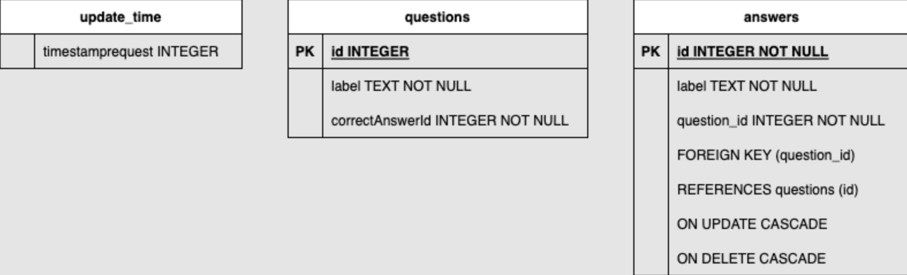

# Persistence 

## Shared Preferences 

### Definition

- What are Shared Preferences?
- Use cases for using Shared Preferences.
- Differences between Shared Preferences and other data storage options.

Shared Preferences provide a simple way to store key-value pairs persistently. This lesson introduces you to the concept of Shared Preferences and explores their use cases. You'll also learn how Shared Preferences differ from other data storage options like files and databases.

### usage

- Setting and retrieving data in Shared Preferences.
- Handling different data types.
- Best practices for using Shared Preferences.

You'll dive into practical usage by learning how to set and retrieve data in Shared Preferences. This lesson covers various data types and provides best practices for effectively using Shared Preferences in your Flutter app.

##  File I/O 

- Understanding file operations.
- Reading and writing files in Flutter.
- Permissions and file handling best practices.

Files are essential for storing and managing data in many applications. This lesson guides you through the basics of file input/output operations in Flutter, including reading and writing files. You'll also learn about permissions and best practices for secure and efficient file handling.

##  Database

- What is SQLite and its role in Flutter.
- Benefits of using a relational database.
- When to choose SQLite for data storage.

SQLite is a powerful and lightweight relational database that's commonly used for data storage in Flutter apps. This lesson introduces SQLite, explains its role in Flutter, and helps you understand when to choose SQLite for your data storage needs.

- Creating and managing SQLite databases.
- Performing CRUD (Create, Read, Update, Delete) operations.
- Efficient querying and data retrieval techniques.

You'll dive into the practical aspects of SQLite in Flutter. Learn how to create and manage SQLite databases, perform CRUD operations, and implement efficient querying and data retrieval techniques to interact with your database effectively.

## 🧪 Exercices 

Implement the database for the quiz respecting the following clean architecture repository pattern : 

* First app launch with network: 
   - With network: Make an API request and store in the database.
   - Without network: Generate a mock list of questions.
* First app launch without network:
   - Return data from the database.
* App launch without network:
   - Return data from the database.
* App launch with network, with the last request within 5 minutes:
   - Return data from the database.
* App launch with network, with the last request over 5 minutes ago:
  - Make an API request, return the data, and store in the database.

The database should be as follow

You can store the time 

## 🎯 Solutions

::: details click here to view the solutions
[Zapp.run project with http request](https://zapp.run/edit/quiz-z9q06jl9r06)
::: 

## 📖 Further reading

- [SQLite](https://docs.flutter.dev/cookbook/persistence/sqlite)
- [SharedPrefs](https://docs.flutter.dev/cookbook/persistence/key-value)