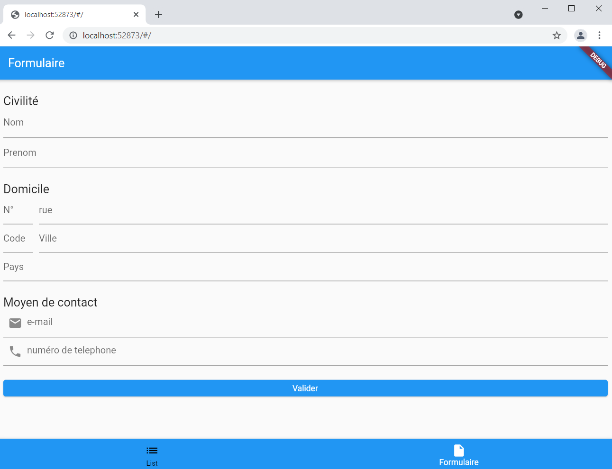
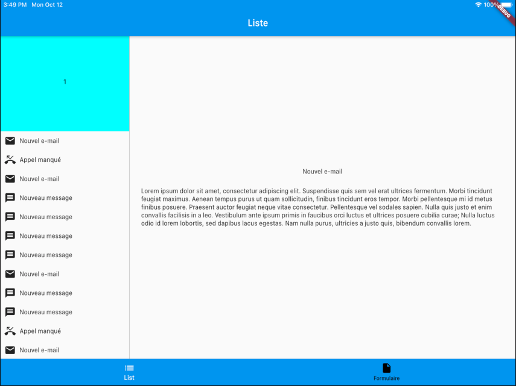
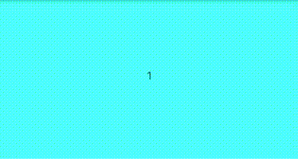
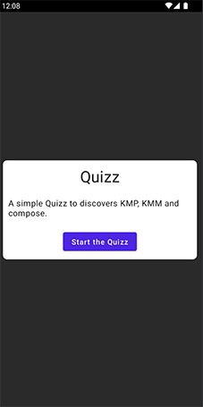
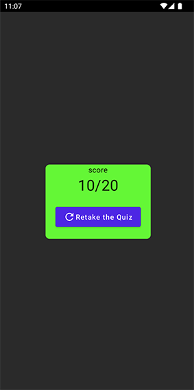
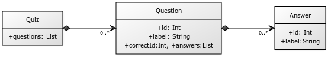
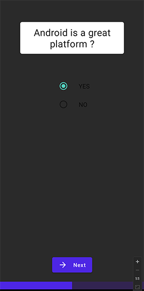

#  Widgets

- What are widgets in Flutter?
- The importance of widgets in building user interfaces.
- Different types of widgets in Flutter.

In Flutter, everything is a widget. Widgets are the building blocks of your app's user interface. They control what is displayed on the screen and how it responds to user interactions.

Widgets are divided into two main categories: StatelessWidget and StatefulWidget. You'll learn the key differences between them and when to use each.

## Widget Tree and Element Tree

The Widget tree represents the hierarchy of widgets in your app. Each widget is a part of this tree. When changes occur, Flutter creates a new Widget tree. The Element tree, on the other hand, represents the corresponding elements for each widget in the Widget tree.


## Overview of Widgets and Layout

- Text, Container, Row, Column.
- Layout widgets for structuring your UI.
- Working with Alignment and CrossAxisAlignment.


We'll explore some frequently used widgets like Text for displaying text, Container for layout, and Row and Column for organizing widgets. You'll also discover how to align and position widgets within your layout using Alignment and CrossAxisAlignment.

## Classifications of Widgets: Stateful and Stateless

Flutter Stateful and Stateless widgets are two fundamental kinds of widgets that Flutter provides. As their names imply, Stateless Widgets are static and don't hold mutable state, while Stateful Widgets are dynamic, and they maintain a mutable state that can change over time.

### Stateless Widgets

Stateless widgets are those in which you want to make a UI that does not need to be dynamically changed whenever you update any value bound to it. For example, if you want to make a button whose title doesn’t need to change dynamically, then you can create a separate widget for a button as a Stateless widget.
As the name suggests, Stateless widgets are immutable.
Stateless widgets remain the same even if the user interacts with them. This kind of widget has no state, so they can’t change according to an internal state. They can only react to higher widget changes.
Stateless widgets cannot change their state during the runtime of the app, which means the widgets cannot be redrawn while the app is in action.

Example :

```dart
import 'package:flutter/material.dart';
void main() => runApp(MyApp());
class MyApp extends StatelessWidget {
    @override
    Widget build(BuildContext context) {
        return Container();
    }
}
```

### Stateful Widgets

Stateful widgets are just the reverse of Stateless widgets. This means when you want to make something that you want to change dynamically according to how a user interacts with it, then you can use the Stateful widget. For example, if you want to change the background color of the app on click of a button, you can make use of Stateful widget in this case.
A Stateful widget can contain another Stateless widget and vice-versa.

```dart
import 'package:flutter/material.dart';
void main() => runApp(MyApp());
class MyApp extends StatefulWidget {
    @override
    _MyAppState createState() => _MyAppState();
}
class _MyAppState extends State<MyApp> {
    @override
    Widget build(BuildContext context) {
        return Container();
    }
}
```

### Difference between Stateful and Stateless Widgets

| Stateless Widget | Stateful Widget |
| ---------------- | --------------- |
| Static widgets   | Dynamic Widgets |
| They do not depend on any data change or any behavior change.   | They can be updated during runtime based on user action or data change.        |
|  Stateless Widgets do not have a state.  | Stateful Widgets have an internal state. |
|  They will be rendered once and will not update themselves, but will only be updated when external data changes.  | They can re-render if the input data changes or if Widget’s state changes. |
|  For Example, Text, Icon, and RaisedButton are Stateless Widgets.   | For Example Checkbox, Radio Button, and Slider are Stateful Widgets |

## Lifecycle


## Passing Data Between Widgets

In complex apps, different widgets often need to share data. We'll discuss various methods for passing data between widgets, including constructor arguments, callback functions, and InheritedWidget.

## Resource Management

Learn how to manage resources like images, strings, and fonts in Flutter.

- Loading and displaying images in your app.
- Accessing and using strings and fonts.
- Best practices for resource management.

You'll discover how to load and display images in your Flutter app. We'll also explore accessing and using strings and fonts, vital for creating a well-rounded user interface. Best practices for resource management will be emphasized.

## Material Design and Cupertino Widgets

- Overview of Material Design widgets.
- Introduction to Cupertino widgets.
- Considerations for choosing between the two.

Flutter provides two main design languages: Material Design and Cupertino. You'll explore the widgets associated with each and learn when to use one over the other based on platform-specific design guidelines.

## 🧪 Exercices 

### Exercise 1 - Build a form with validation

The purpose of this part is to set up an information entry form :
The information to be collected are : 
* name, 
* first name, 
* address (number, street, city, postal code and country)
* an email address
* a telephone number.

At the end of the form a button will validate the form
When clicking on it, validation of the fields must be handled :
* the fields must not be empty
* the telephone number and  email must respect the following regex

```dart
final RegExp _email = RegExp(
      r"^((([a-z]|\d|[!#\$%&'\*\+\-\/=\?\^_`{\|}~]|[\u00A0-\uD7FF\uF900-\uFDCF\uFDF0-\uFFEF])+(\.([a-z]|\d|[!#\$%&'\*\+\-\/=\?\^_`{\|}~]|[\u00A0-\uD7FF\uF900-\uFDCF\uFDF0-\uFFEF])+)*)|((\x22)((((\x20|\x09)*(\x0d\x0a))?(\x20|\x09)+)?(([\x01-\x08\x0b\x0c\x0e-\x1f\x7f]|\x21|[\x23-\x5b]|[\x5d-\x7e]|[\u00A0-\uD7FF\uF900-\uFDCF\uFDF0-\uFFEF])|(\\([\x01-\x09\x0b\x0c\x0d-\x7f]|[\u00A0-\uD7FF\uF900-\uFDCF\uFDF0-\uFFEF]))))*(((\x20|\x09)*(\x0d\x0a))?(\x20|\x09)+)?(\x22)))@((([a-z]|\d|[\u00A0-\uD7FF\uF900-\uFDCF\uFDF0-\uFFEF])|(([a-z]|\d|[\u00A0-\uD7FF\uF900-\uFDCF\uFDF0-\uFFEF])([a-z]|\d|-|\.|_|~|[\u00A0-\uD7FF\uF900-\uFDCF\uFDF0-\uFFEF])*([a-z]|\d|[\u00A0-\uD7FF\uF900-\uFDCF\uFDF0-\uFFEF])))\.)+(([a-z]|[\u00A0-\uD7FF\uF900-\uFDCF\uFDF0-\uFFEF])|(([a-z]|[\u00A0-\uD7FF\uF900-\uFDCF\uFDF0-\uFFEF])([a-z]|\d|-|\.|_|~|[\u00A0-\uD7FF\uF900-\uFDCF\uFDF0-\uFFEF])*([a-z]|[\u00A0-\uD7FF\uF900-\uFDCF\uFDF0-\uFFEF])))$");
      
final RegExp _phone = RegExp(r'^(?:(?:\+|00)33|0)\s*(3|6|7)(?:[\s.-]*\d{2}){4}$');
```

Then, we display a popup summarizing the information of the form. 

If validation is KO: error messages corresponding to the according problem should be displayed below the corresponding form fields.

Fields linked to the address must display a hint allowing you to know which
field it is. 

Fields linked to email and telephone number must display a
hint and an icon. 

The other fields must display a label.

If the fields take up too much space on the screen, it must be scrollable.

See below the expected result : 



### Exercise 2 : Setup a list randomly generated items

Set up a list randomly generated items.
In a new screen you will have to display a list whose content is generated by the `getRandomItem`method of utils.dart (file provided to add to the project). 

Each tile in the list corresponds to an item in the list, you  need to display only the iconData and the title of the item.

Here is the following result : 


::: details  utils.dart to import on your project
```dart
import 'dart:math';

import 'package:flutter/material.dart';

final _iconList = [Icons.mail, Icons.phone_missed, Icons.message, Icons.event];

class Item {
  final IconData iconData;
  final String title;
  final String content;

  Item(this.iconData, this.title, this.content);
}

List<Item> getRandomItem() {
  Random random = Random();
  int numberOfItem = 0;
  for (var i = 0; i < 10; i++) {
    numberOfItem = numberOfItem + (random.nextInt(3) + 1);
  }
  List<Item> itemList = List();
  for (var i = 0; i < numberOfItem; i++) {
    int iconIndex = random.nextInt(4);
    IconData iconData = _iconList[iconIndex];
    String message;
    if (iconData == Icons.mail) {
      message = "Nouvel e-mail";
    } else if (iconData == Icons.phone_missed) {
      message = "Appel manqué";
    } else if (iconData == Icons.message) {
      message = "Nouveau message";
    } else {
      message = "Nouvel événement";
    }
    String content =
        "Lorem ipsum dolor sit amet, consectetur adipiscing elit. Suspendisse quis sem vel erat ultrices fermentum. Morbi tincidunt feugiat maximus. Aenean tempus purus ut quam sollicitudin, finibus tincidunt eros tempor. Morbi pellentesque mi id metus finibus posuere. Praesent auctor feugiat neque vitae consectetur. Pellentesque vel sodales sapien. Nulla quis justo et enim convallis facilisis in a leo. Vestibulum ante ipsum primis in faucibus orci luctus et ultrices posuere cubilia curae; Nulla luctus odio id lorem lobortis, sed dapibus lacus egestas. Nam nulla purus, ultricies a justo quis, bibendum convallis lorem.";
    itemList.add(Item(iconData, message, content));
  }
  return itemList;
}

```
:::

### Exercise 3 - Create a detail page of one item with 'PageView'

The goal of this part is to set up a PageView as the first cell of the list created in exercise 2.
 
This will be composed of 3 pages, each page must be a rectangle of different colors.

A number must be displayed centered in the middle of the page, this number must not move when scrolling on the PageView, this number must indicate the number of the active page of the PageView (see: video).

The result is as following :



### Exercice 4 : BottomNavigation + Appbar

The goal of this part is to set up a BottomNavigationBar allowing you to navigate between the screens created in Exercice 1 and 2 and an AppBar : 

* The AppBar title must adapt to the displayed screen.
* AppBar buttons must contain an icon and a label.

## 🎯 Solutions

::: details MyFormPage.dart
```dart
import 'package:flutter/material.dart';
import 'package:flutter/services.dart';

class MyFormPage extends StatelessWidget {
  final _formKey = GlobalKey<FormState>();
  final RegExp _email = RegExp(
      r"^((([a-z]|\d|[!#\$%&'\*\+\-\/=\?\^_`{\|}~]|[\u00A0-\uD7FF\uF900-\uFDCF\uFDF0-\uFFEF])+(\.([a-z]|\d|[!#\$%&'\*\+\-\/=\?\^_`{\|}~]|[\u00A0-\uD7FF\uF900-\uFDCF\uFDF0-\uFFEF])+)*)|((\x22)((((\x20|\x09)*(\x0d\x0a))?(\x20|\x09)+)?(([\x01-\x08\x0b\x0c\x0e-\x1f\x7f]|\x21|[\x23-\x5b]|[\x5d-\x7e]|[\u00A0-\uD7FF\uF900-\uFDCF\uFDF0-\uFFEF])|(\\([\x01-\x09\x0b\x0c\x0d-\x7f]|[\u00A0-\uD7FF\uF900-\uFDCF\uFDF0-\uFFEF]))))*(((\x20|\x09)*(\x0d\x0a))?(\x20|\x09)+)?(\x22)))@((([a-z]|\d|[\u00A0-\uD7FF\uF900-\uFDCF\uFDF0-\uFFEF])|(([a-z]|\d|[\u00A0-\uD7FF\uF900-\uFDCF\uFDF0-\uFFEF])([a-z]|\d|-|\.|_|~|[\u00A0-\uD7FF\uF900-\uFDCF\uFDF0-\uFFEF])*([a-z]|\d|[\u00A0-\uD7FF\uF900-\uFDCF\uFDF0-\uFFEF])))\.)+(([a-z]|[\u00A0-\uD7FF\uF900-\uFDCF\uFDF0-\uFFEF])|(([a-z]|[\u00A0-\uD7FF\uF900-\uFDCF\uFDF0-\uFFEF])([a-z]|\d|-|\.|_|~|[\u00A0-\uD7FF\uF900-\uFDCF\uFDF0-\uFFEF])*([a-z]|[\u00A0-\uD7FF\uF900-\uFDCF\uFDF0-\uFFEF])))$");

  //regex numéro te telephone français en 03, 06 ou 07
  final RegExp _phone =
      RegExp(r'^(?:(?:\+|00)33|0)\s*(3|6|7)(?:[\s.-]*\d{2}){4}$');

  final TextEditingController _lastNameController = TextEditingController();
  final TextEditingController _firstNameController = TextEditingController();
  final TextEditingController _addressNumberController =
      TextEditingController();
  final TextEditingController _addressRoadController = TextEditingController();
  final TextEditingController _addressZipCodeController =
      TextEditingController();
  final TextEditingController _addressCountryController =
      TextEditingController();
  final TextEditingController _mailController = TextEditingController();
  final TextEditingController _phoneController = TextEditingController();
  final TextEditingController _addressCityController = TextEditingController();

  MyFormPage({Key? key}) : super(key: key);

  @override
  Widget build(BuildContext context) {
    return Scaffold(
      appBar: AppBar(
        title: const Text("Formulaire"),
      ),
      body: Form(
          key: _formKey,
          child: Padding(
            padding: const EdgeInsets.symmetric(horizontal: 8.0),
            child: ListView(
              children: [
                const SizedBox(
                  height: 24,
                ),
                Text(
                  "Civilité",
                  style: Theme.of(context).textTheme.headline6,
                ),
                TextFormField(
                  controller: _lastNameController,
                  decoration: const InputDecoration(labelText: "Nom"),
                  // The validator receives the text that the user has entered.
                  validator: (value) {
                    if (value == null || value.isEmpty) {
                      return 'Entrez votre nom';
                    }
                    return null;
                  },
                ),
                TextFormField(
                  controller: _firstNameController,
                  decoration: const InputDecoration(labelText: "Prenom"),
                  validator: (value) {
                    if (value == null || value.isEmpty) {
                      return 'Entrez votre prénom';
                    }
                    return null;
                  },
                ),
                const SizedBox(
                  height: 24,
                ),
                Text(
                  "Domicile",
                  style: Theme.of(context).textTheme.headline6,
                ),
                Row(
                  mainAxisSize: MainAxisSize.max,
                  children: [
                    Flexible(
                      flex: 1,
                      child: TextFormField(
                        controller: _addressNumberController,
                        decoration: const InputDecoration(hintText: "N°"),
                        validator: (value) {
                          if (value == null || value.isEmpty) {
                            return 'Entrez un numéro';
                          }
                          return null;
                        },
                      ),
                    ),
                    const SizedBox(
                      width: 10,
                    ),
                    Expanded(
                      flex: 3,
                      child: TextFormField(
                        keyboardType: TextInputType.streetAddress,
                        controller: _addressRoadController,
                        decoration: const InputDecoration(hintText: "rue"),
                        validator: (value) {
                          if (value == null || value.isEmpty) {
                            return 'Entrez un nom de rue';
                          }
                          return null;
                        },
                      ),
                    ),
                  ],
                ),
                Row(
                  children: [
                    SizedBox(
                      width: 50,
                      child: TextFormField(
                        maxLengthEnforcement: MaxLengthEnforcement.enforced,
                        maxLength: 5,
                        keyboardType: TextInputType.number,
                        controller: _addressZipCodeController,
                        decoration: const InputDecoration(
                            hintText: "Code", counterText: ""),
                        validator: (value) {
                          if (value == null || value.isEmpty) {
                            return 'Entrez un code postal';
                          }
                          return null;
                        },
                      ),
                    ),
                    const SizedBox(
                      width: 10,
                    ),
                    Expanded(
                      child: TextFormField(
                        controller: _addressCityController,
                        decoration: const InputDecoration(hintText: "Ville"),
                        validator: (value) {
                          if (value == null || value.isEmpty) {
                            return 'Entrez un nom de ville';
                          }
                          return null;
                        },
                      ),
                    )
                  ],
                ),
                TextFormField(
                  controller: _addressCountryController,
                  decoration: const InputDecoration(hintText: "Pays"),
                  validator: (value) {
                    if (value == null || value.isEmpty) {
                      return 'Entrez un nom de pays';
                    }
                    return null;
                  },
                ),
                const SizedBox(
                  height: 24,
                ),
                Text(
                  "Moyen de contact",
                  style: Theme.of(context).textTheme.headline6,
                ),
                TextFormField(
                  controller: _mailController,
                  decoration: const InputDecoration(
                      hintText: "e-mail", prefixIcon: Icon(Icons.mail)),
                  validator: (value) {
                    if (value == null || value.isEmpty) {
                      return 'Entrez une adresse e-mail';
                    } else if (!_email.hasMatch(value)) {
                      return 'Adresse e-mail invalide';
                    }
                    return null;
                  },
                ),
                TextFormField(
                  controller: _phoneController,
                  decoration: const InputDecoration(
                    hintText: "numéro de telephone",
                    prefixIcon: Icon(Icons.phone),
                  ),
                  validator: (value) {
                    if (value == null || value.isEmpty) {
                      return 'Entrez un numéro de telephone';
                    } else if (!_phone.hasMatch(value)) {
                      return 'Numéro de téléphone invalide';
                    }
                    return null;
                  },
                ),
                const SizedBox(
                  height: 24,
                ),
                ElevatedButton(
                  style: ButtonStyle(
                    foregroundColor:
                        MaterialStateProperty.resolveWith((Set states) {
                      return Colors.blueAccent;
                    }),
                  ),
                  onPressed: () {
                    // Validate returns true if the form is valid, or false otherwise.
                    if (_formKey.currentState!.validate()) {
                      showDialog(
                        context: context,
                        builder: (context) {
                          return AlertDialog(
                            content: Column(
                              crossAxisAlignment: CrossAxisAlignment.start,
                              mainAxisSize: MainAxisSize.min,
                              children: [
                                Text(
                                  'Bonjour ${_firstNameController.text} ${_lastNameController.text.toUpperCase()}',
                                ),
                                const SizedBox(
                                  height: 8,
                                ),
                                Text(
                                  'Votre adresse est ${_addressNumberController.text} ${_addressRoadController.text}\n${_addressZipCodeController.text} ${_addressCityController.text} ${_addressCountryController.text}',
                                ),
                                const SizedBox(
                                  height: 8,
                                ),
                                Text('Mail : ${_mailController.text}'),
                                const SizedBox(
                                  height: 8,
                                ),
                                Text('Phone : ${_phoneController.text}')
                              ],
                            ),
                          );
                        },
                      );
                    }
                  },
                  child: const Text(
                    'Valider',
                    style: TextStyle(
                      color: Colors.white,
                    ),
                  ),
                ),
                const SizedBox(
                  height: 24,
                ),
              ],
            ),
          )),
    );
  }
}
```
:::

::: details MyListPage.dart
```dart
import 'package:flutter/material.dart';

import '../utils.dart';

class MyListPage extends StatelessWidget {
  const MyListPage({Key? key, required this.itemList}) : super(key: key);

  final List<Item> itemList;

  @override
  Widget build(BuildContext context) {
    return Scaffold(
      appBar: AppBar(
        title: const Text("Liste"),
      ),
      body: ListView.builder(
          itemCount: itemList.length,
          itemBuilder: (BuildContext listContext, int index) {
            var item = itemList[index];
            return Row(
              mainAxisSize: MainAxisSize.min,
              children: [
                Padding(
                  padding: const EdgeInsets.all(8),
                  child: Icon(item.iconData),
                ),
                Text(
                  item.title,
                  style: const TextStyle(
                    fontSize: 12,
                    color: Colors.black,
                  ),
                ),
              ],
            );
          }),
    );
  }
}
```
:::

::: details MyListPage.dart
```dart
import 'package:flutter/material.dart';

import '../utils.dart' as utils;

class MyListPage extends StatefulWidget {
  @override
  _MyListPageState createState() => _MyListPageState();

  const MyListPage({
    Key? key,
    required this.itemList,
  }) : super(key: key);

  final List<utils.Item> itemList;
}

class _MyListPageState extends State<MyListPage> {
  int _currentPagerIndex = 0;

  @override
  Widget build(BuildContext context) {
    return ListView.builder(
        itemCount: widget.itemList.length + 1,
        itemBuilder: (BuildContext listContext, int index) {
          if (index == 0) {
            return SizedBox(
              height: 200,
              child: Stack(
                children: [
                  Positioned.fill(
                    child: PageView(
                      onPageChanged: (index) {
                        setState(() {
                          _currentPagerIndex = index;
                        });
                      },
                      children: <Widget>[
                        Container(
                          color: Colors.cyanAccent,
                        ),
                        Container(
                          color: Colors.greenAccent,
                        ),
                        Container(
                          color: Colors.yellowAccent,
                        ),
                      ],
                    ),
                  ),
                  Align(
                    alignment: Alignment.center,
                    child: Padding(
                      padding: const EdgeInsets.only(bottom: 8.0),
                      child: Text(getText(_currentPagerIndex)),
                    ),
                  ),
                ],
              ),
            );
          }
          var item = widget.itemList[index - 1];
          return Row(
            mainAxisSize: MainAxisSize.max,
            crossAxisAlignment: CrossAxisAlignment.center,
            children: [
              Padding(
                padding: const EdgeInsets.all(8),
                child: Icon(item.iconData),
              ),
              Text(item.title),
            ],
          );
        });
  }

  getText(int currentPagerIndex) {
    if (currentPagerIndex == 0) {
      return '1';
    } else if (currentPagerIndex == 1) {
      return "2";
    } else {
      return "3";
    }
  }
}
```
:::

::: details MainScreen.dart
```dart
import 'package:flutter/material.dart';
import 'package:flutter_widget_part2/presentation/MyListPage.dart';

import '../utils.dart';

class MainScreen extends StatefulWidget {
  const MainScreen({Key? key}) : super(key: key);

  @override
  _MainScreenState createState() => _MainScreenState();
}

class _MainScreenState extends State<MainScreen> {
  final List<Item> _itemList = getRandomItem();

  @override
  Widget build(BuildContext context) {
    return Scaffold(
      appBar: AppBar(
        title: const Text("Liste"),
      ),
      body: MyListPage(
        itemList: _itemList,
      ),
    );
  }
}

```
4. **BottomNavigation + Appbar**

#### **`main_screen.dart`**
```dart
import 'package:flutter/material.dart';
import 'package:flutter_widget_part2/presentation/MyFormPage.dart';

import '../utils.dart';
import 'MyListPage.dart';

class MainScreen extends StatefulWidget {
  const MainScreen({Key? key}) : super(key: key);

  @override
  _MainScreenState createState() => _MainScreenState();
}

class _MainScreenState extends State<MainScreen> {
  int _currentIndex = 0;

  final List<Widget> _tabs = [
    MyListPage(itemList: getRandomItem()),
    MyFormPage(),
  ];

  @override
  Widget build(BuildContext context) {
    return Scaffold(
      appBar: AppBar(
        title: Text(_currentIndex == 0 ? "Liste" : "Formulaire"),
      ),
      body: _tabs[_currentIndex],
      bottomNavigationBar: BottomNavigationBar(
          currentIndex: _currentIndex,
          selectedItemColor: Colors.white,
          unselectedItemColor: Colors.black,
          backgroundColor: Colors.blue,
          onTap: (index) {
            setState(() {
              _currentIndex = index;
            });
          },
          items: const [
            BottomNavigationBarItem(
              icon: Icon(Icons.list),
              label: "List",
            ),
            BottomNavigationBarItem(
              icon: Icon(Icons.insert_drive_file),
              label: "Formulaire",
            )
          ]),
    );
  }
}
```
::: 


## Create widgets for the Quiz

### 🧪 WelcomeScreen



You can now create your first view.
For the Quiz we need a welcome screen displaying a Card centered with a button inside to start the quiz
It is simply compose of the following composables :
* a Card  rounded shape container
* a Text 
* a Button

* Create a new widget `welcome_screen.dart`  
* Make sure that the MyApp() widget is calling it

```dart
class MyApp extends StatelessWidget {
  const MyApp({super.key});

  // This widget is the root of your application.
  @override
  Widget build(BuildContext context) {
    return MaterialApp(
      title: 'Quiz app',
      theme: ThemeData(
        primarySwatch: Colors.blue
      ),
      home: const WelcomeScreen(),
    );
  }
}
```
* Run you first widget on all platforms , it should work. 

### 🎯 Solutions

::: details welcome_screen.dart
```dart
import 'package:flutter/material.dart';
import 'package:quiz/question_screen.dart';

class WelcomeScreen extends StatelessWidget {
  const WelcomeScreen({super.key});

  @override
  Widget build(BuildContext context) {
    return Scaffold(
      body: Center(
        child: Padding(
          padding: const EdgeInsets.all(10.0),
          child: IntrinsicHeight(
            child: Card(
              shape: RoundedRectangleBorder(
                borderRadius: BorderRadius.circular(8.0),
              ),
              child: Padding(
                padding: const EdgeInsets.all(10.0),
                child: Column(
                  mainAxisAlignment: MainAxisAlignment.center,
                  crossAxisAlignment: CrossAxisAlignment.center,
                  children: [
                    const Text(
                      'Quiz',
                      style: TextStyle(
                        fontSize: 30.0,
                        fontWeight: FontWeight.bold,
                      ),
                    ),
                    const SizedBox(height: 10.0),
                    const Text(
                      'A simple Quiz to discover Flutter widgets',
                      textAlign: TextAlign.center,
                    ),
                    const SizedBox(height: 10.0),
                    ElevatedButton(
                      onPressed: () {},
                      child: const Text('Start the Quiz'),
                    ),
                  ],
                ),
              ),
            ),
          ),
        ),
      ),
    );
  }
}

```
:::

### 🧪 ScoreScreen



The second view will be quite similar but able de show final scores


* Create a new composable `score_screen.dart` on commonMain module 
* Make sure that the MayApp() widget is using it has below 
* The composable will have a `String` value as parameter

```dart
class MyApp extends StatelessWidget {
  const MyApp({super.key});

  // This widget is the root of your application.
  @override
  Widget build(BuildContext context) {
    return MaterialApp(
      title: 'Quiz app',
      theme: ThemeData(
        primarySwatch: Colors.blue
      ),
      home: const ScoreScreen("10/20"),
    );
  }
}
```

* Run you first view on all platforms , it should work. 

### 🎯 Solutions

::: details score_screen.dart

```dart
import 'package:flutter/material.dart';
import 'package:quiz/question_screen.dart';

class ScoreScreen extends StatelessWidget {
  final String score;

  const ScoreScreen({super.key, required this.score});

  @override
  Widget build(BuildContext context) {
    return Scaffold(
      body: Center(
        child: Padding(
          padding: const EdgeInsets.all(10.0),
          child: IntrinsicHeight(
            child: Card(
              shape: RoundedRectangleBorder(
                borderRadius: BorderRadius.circular(8.0),
              ),
              color: Colors.green,
              child: Padding(
                padding: const EdgeInsets.all(10.0),
                child: Column(
                  mainAxisAlignment: MainAxisAlignment.center,
                  crossAxisAlignment: CrossAxisAlignment.center,
                  children: [
                    const Text(
                      'Score',
                      style: TextStyle(
                        fontSize: 15.0,
                        color: Colors.white,
                      ),
                    ),
                    Text(
                      score,
                      style: const TextStyle(
                        fontSize: 30.0,
                        color: Colors.white,
                      ),
                    ),
                    const SizedBox(height: 20.0),
                    ElevatedButton.icon(
                      onPressed: () { },
                      icon: const Icon(Icons.refresh),
                      label: const Text('Retake the Quiz'),
                    ),
                  ],
                ),
              ),
            ),
          ),
        ),
      ),
    );
  }
}
```
:::

### 🧪 QuestionScreen

#### Data classes for Quiz modeling

  

::: details Answer.dart
```dart
class Answer {
  int id;
  String label;
  Answer({
    required this.id,
    required this.label,
  });
}
```
:::

::: details Question.dart
```dart
class Question {
  int id;
  String label;
  int correctAnswerId;
  List<Answer> answers;

  Question({
    required this.id,
    required this.label,
    required this.correctAnswerId,
    required this.answers,
  });

   }

```
:::


::: details Quiz.dart 
```dart
class Quiz {
  List<Question> questions;
  Quiz({required this.questions});
}
```
:::

#### Make the widget statefull

Now we can make a widget with interactions.

  

The screen is composed of  : 
* The question label in a `Card`
* Single choice answer component with `Radio`
* A `Button` to submit the answer
* A `LinearProgressIndicator` indicating the quiz progress

After creating the UI view, we can pass to this composable the list of questions.
When the `MyApp`widget will create `questionScreen()` composable you will  mock questions data for now to generate the list of questions.


### 🎯 Solutions

::: details question_screen.dart 
```dart 
import 'package:flutter/material.dart';
import 'package:quiz/data.dart';
import 'package:quiz/score_screen.dart';
import 'package:quiz/network.dart';


class QuestionScreen extends StatefulWidget {
  final List<Question> questions;
  const QuestionScreen({Key? key, required this.questions}) : super(key: key);


  @override
  State<QuestionScreen> createState() => _QuestionScreenState();
}

class _QuestionScreenState extends State<QuestionScreen> {

  int questionProgress = 0;
  int selectedAnswer = 1;
  int score = 0;

  void _nextOrDone() {
    if (selectedAnswer == widget.questions[questionProgress].correctAnswerId) {
      setState(() {
        score++;
      });
    }
    if (questionProgress < widget.questions.length - 1) {
      setState(() {
        questionProgress++;
        selectedAnswer = 1;
      });
    } else {
      Navigator.push(
        context,
        MaterialPageRoute(
          builder: (context) =>
              ScoreScreen(score: '$score/${widget.questions.length}'), // Pass score here
        ),
      );
    }
  }

  @override
  Widget build(BuildContext context) {
    return Scaffold(
            body: Center(
              child: Column(
                mainAxisAlignment: MainAxisAlignment.start,
                crossAxisAlignment: CrossAxisAlignment.center,
                children: [
                  Card(
                    shape: RoundedRectangleBorder(
                      borderRadius: BorderRadius.circular(5.0),
                    ),
                    margin: const EdgeInsets.all(60.0),
                    child: Padding(
                      padding: const EdgeInsets.symmetric(horizontal: 10.0),
                      child: Text(
                        widget.questions[questionProgress].label,
                        style: const TextStyle(fontSize: 25.0),
                        textAlign: TextAlign.center,
                      ),
                    ),
                  ),
                  Column(
                    mainAxisAlignment: MainAxisAlignment.center,
                    crossAxisAlignment: CrossAxisAlignment.center,
                    children: widget.questions[questionProgress].answers
                        .map(
                          (answer) => Padding(
                            padding: const EdgeInsets.symmetric(vertical: 8.0),
                            child: Row(
                              mainAxisAlignment: MainAxisAlignment.center,
                              crossAxisAlignment: CrossAxisAlignment.center,
                              children: [
                                Radio(
                                  value: answer.id,
                                  groupValue: selectedAnswer,
                                  onChanged: (value) {
                                    setState(() {
                                      selectedAnswer = value as int;
                                    });
                                  },
                                ),
                                const SizedBox(
                                    width:
                                        8), // Adjust the spacing here if needed
                                Text(
                                  answer.label,
                                  textAlign: TextAlign.center,
                                ),
                              ],
                            ),
                          ),
                        )
                        .toList(),
                  ),
                ],
              ),
            ),
            floatingActionButton: FloatingActionButton(
              onPressed: () {_nextOrDone();},
              child: questionProgress < widget.questions.length - 1
                  ? const Icon(Icons.arrow_forward)
                  : const Icon(Icons.done),
            ),
            bottomNavigationBar: LinearProgressIndicator(
              value: (questionProgress + 1) / widget.questions.length,
              minHeight: 20.0,
            ),
          );
        }
      }

```
:::

::: main.dart 
```dart 
class MyApp extends StatelessWidget {
  const MyApp({super.key});

  // This widget is the root of your application.
  @override
  Widget build(BuildContext context) {
    return MaterialApp(
      title: 'Quiz app',
      theme: ThemeData(
        primarySwatch: Colors.blue
      ),
      home: const QuestionScreen(generateMockQuestionListHere()),
    );
  }
}
```
:::

Your Quiz have now all his composable screens made. Let's connect it to the Internet


## 📖 Further reading
